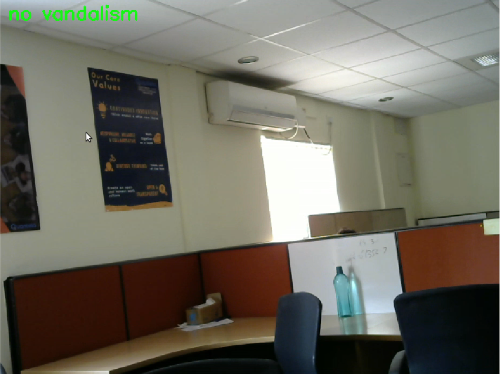
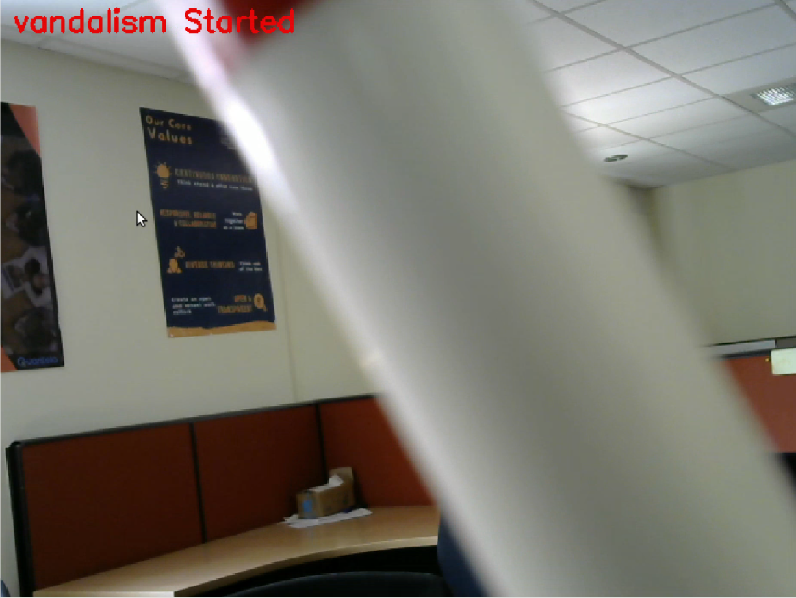
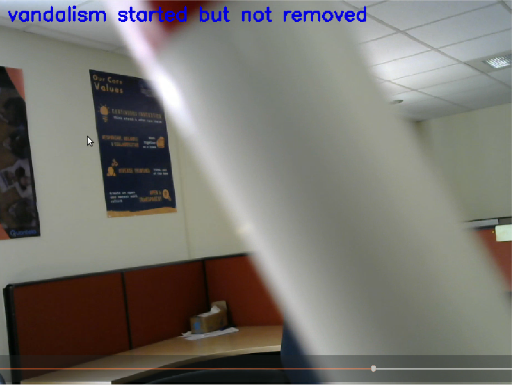
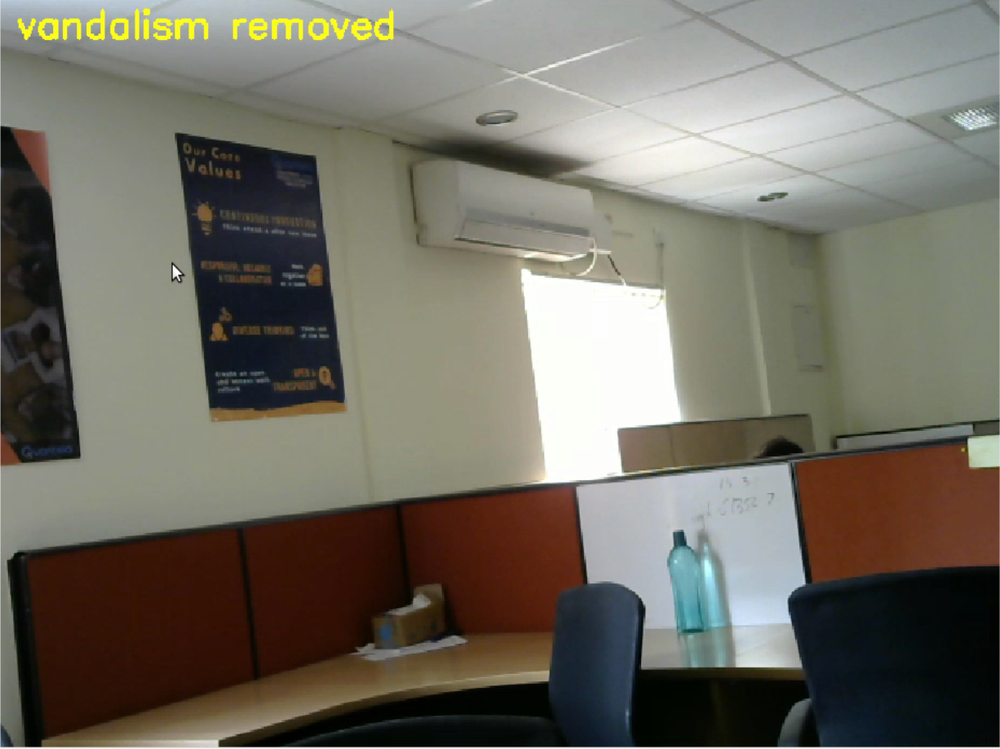
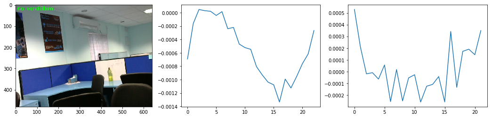
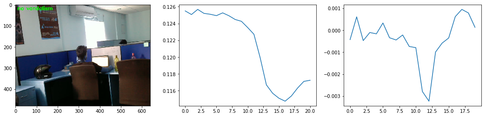

# Camera Vandalism  

## The concept

Camera vandalism detection is concerned with finding out if some kind of sabotage is done to a camera setup. 


```python
from IPython.display import Image
from IPython.core.display import HTML, display
```


```python
display(HTML("<table><tr><td></td><td></td></tr></table>"))
```


<table><tr><td></td><td></td></tr></table>


## Conceptual categorization
On high-level, there could be the following categorization of the cases that can be checked:


### Engineering cases
* These cases checks for video feed avalibility and integrity.
* Works for RTSP(.mkv, .webm, .mpg), Video files(.mp4, .avi), and Web cameras(channels:0/1/2)

### Intelligence cases
* Cases dealt here give actionable insights thus help in intelligent decision making.

## API description with workflow

### 1. Imports


```python
from camera_vandalism import CameraVandalism
```

## Engineering cases

### 2.a. Instantiate object with RTSP url


```python
obj = CameraVandalism('rtsp://192.168.1.4:8554/demoVideo.mpg')
```

    Init done!


### 2.a.(i) Connection Refused/Not found check


```python
obj.check_camera_vandalism()
```

    rtsp://192.168.1.4:8554/demoVideo.mpg
    
    Error-1: Connection refused at time: 2018_02_01_19_08_17
    
    Error-1: Connection refused at time: 2018_02_01_19_08_19
    
    Error-1: Connection refused at time: 2018_02_01_19_08_21


### 2.a.(ii) Connection set but feed not available check


```python
obj.check_camera_vandalism()
```

    rtsp://192.168.1.4:8554/demoVideo.mpg
    
    Error-2: Camera connected but video feed not available. at time: 2018_02_01_19_08_58
    
    Error-2: Camera connected but video feed not available. at time: 2018_02_01_19_09_00
    
    Error-2: Camera connected but video feed not available. at time: 2018_02_01_19_09_02


### 2.a.(iii) Connection set, feed available but incorrupt frames present check


```python
obj.check_camera_vandalism()
```

    rtsp://192.168.1.4:8554/demoVideo.mpg
    
    Error-3: Camera connected but incoming images are invalid. at time: 2018_02_01_19_09_43
    
    Error-3: Camera connected but incoming images are invalid. at time: 2018_02_01_19_09_45
    
    Error-3: Camera connected but incoming images are invalid. at time: 2018_02_01_19_09_47


## Intelligence Cases

The intelligent cases follow after the integrity of the video frames have been taken care of. The idea here is to algorithmically analyze each incoming frame for vandalism. 

### The kind of sabotage that we could encounter here could be:

**Camera blockage/obstruction:**

The kind of sabotage that we could encounter here could be:
Camera blockage/obstruction:
* Assume that there is a camera network setup at a sensitive location and some of the cameras here have been sabotaged by inducing some obstruction. Since a given camera has a limited field of view, a simple object could easily block the camera. 
* In general, a human operator is always required to check for such anomalies. 
* Our algorithm takes a novel approach by utilizing gradient information in each frame and raises an alert when the camera is found to be blocked. 


### Intelligence cases - start to end
* No Vandalism
* Vandalism started
* Vandalism started but not removed
* Vandalism removed


```python
display(HTML("<table><tr><td></td><td></td></tr> <tr><td></td><td></td></tr> </table>"))
```


<table><tr><td></td><td></td></tr> <tr><td></td><td></td></tr> </table>


### Configurable parameters

* **-input_video** : path of input video

* **-channel** : video channel(0,1,2)

* **size_short_pool** : small the pool size faster the detection is, but small size of pool will give more false results as well
* **n_jobs** : number of parallel jobs to be used
* **plot** : tracking progress plot
* **file_name** : prefix of all internal files to be stored(IMPORTANT : for historical data if file is available then it will be used directly )
* **thresh_shift_param** : numerical parameter to shift threshold, its a multiplicative param, which stretch threshold 
* **eps_frames** : eps_frame number of frame that should be considered to decide fix threshold 
* **frame_to_start** : frame at which prediction should be started (as in video prediction, a lot of time can be for non-vandalised period )

### 2.b. Instantiate object with video file


```python
obj = CameraVandalism('./videos/inside_office.avi')
```

    
    ***Initialization Complete!***
    


```python
obj.check_camera_vandalism()
```

    -0.000265501945441
    reducing pool size 
    (0.00035031554448610732, 0.00034292689040449158, -0.0012829986264324986, 0.0013583958175677341)
    no vandalism





### 2.c. Instantiate object with web camera


```python
obj = CameraVandalism(1)
```

    camera
    
    ***Initialization Complete!***
    


```python
obj.check_camera_vandalism()
```




